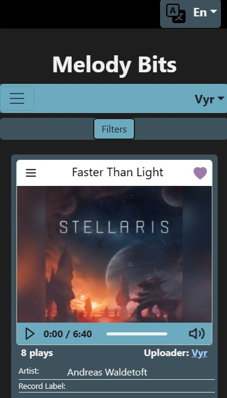

# ReadMe - Melody Bits Client
The client side code of the Melody Bits web application written in TypeScript React.

## Table of Contents

- [ReadMe - Melody Bits Client](#readme---melody-bits-client)
  - [Table of Contents](#table-of-contents)
  - [Installation](#installation)
  - [Overview](#overview)
    - [Browse Page](#browse-page)
    - [Music Upload Page](#music-upload-page)
    - [User Profile](#user-profile)

---

## Installation
To build the project, run:
```
$ npm run build
```

After building the project, the **dist** folder will contain all the project files ready to use.

The client side only has static parts, so a dedicated backend solution for serving the files is not necessary. 

In a test environment, the Visual Code module - Live Server - should be enough to serve the static files.

In a production environment, the built project files should be served as static files.

---

## Overview

### Browse Page


The browse page is responsible for requesting and displaying the music data. The server ideally sends at most an array of 6 JSON objects, each containing data about the music and a link to the cover image location. The server also provides a link through which it streams the audio data.

After changing the filter settings, the page will request a new set of music data with the specified filters.

If the server indicates that it has more music than the maximum amount that the page displays, then a pagination widget will appear beneath the music cards.



The browse page, as well as other pages are optimized for mobile devices for a pleasent UI experience.

---

### Music Upload Page


Users are welcome to upload their own music vie the **Upload music** page.

The selected cover image and audio can be previewed before submitting the music.

Besides the cover image and the audio file, the **title**, **link** **artist** and a few **tags** are necessary to provide before the music is accepted for uploading.

Users will recieve feedback in case the provided data could not be accepted, detailing why it wasn't accepted.

---

### User Profile


Users can review their information on the profile overview page, and edit their **username**, **email** and **bio**.

The Profile Overview page is accessible via a dropdown menu on the navigation bar.


